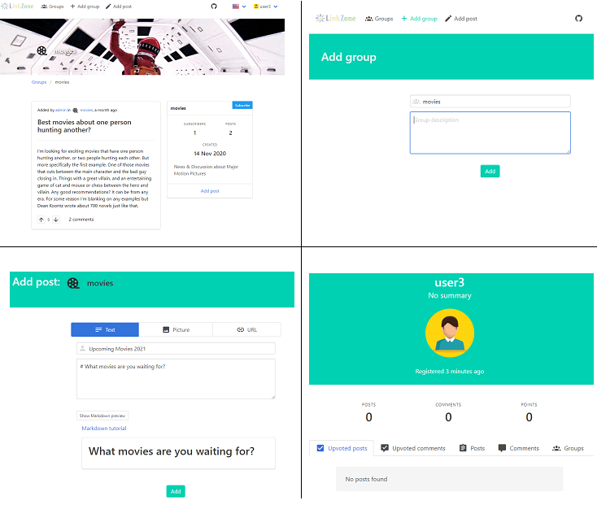

[](https://github.com/erykio/linkzone/actions/workflows/release.yml)

# About
**Linkzone** is a social media app, similar to Reddit, where you can create discussion groups.

### Features
* create discussion groups
* subscribe to a group
* add 3 kinds of posts (text/link/image) in a group
* permissions system (group moderators and administrators, global administrators)
* upload group logos, banners, user avatars
* user uploaded content is stored in AWS S3

# Tech stack
* backend
  * Java 18
  * MySQL 8
  * AWS S3 (Simple Storage Service)
  * Spring Boot 2.7
  * Spring Security with JSON Web Tokens
  * Spring Data JPA
  * Spring Actuator
  * Spring Rest DOCS
  * Spring Cloud
  * Spring Consul
* frontend
  * Node.js 10
  * Vue.js 2.5
* Docker
* Kubernetes

# Local development
1. **[Database]** Run the database at localhost:3306 - `docker-compose up`
2. **[Backend]**
   - Fill out `.env.template`
   - Install EnvFile IDEA plugin that allows you to set environment variables for your run configurations
   - Configure run configuration
     - enable EnvFile plugin and configure it to set environment from the `.env.template` file
   - Run the backend at localhost:8080 - run `io.eryk.linkzone.Application`
3. **[Frontend]** Run dev server at localhost:3000:
```
cd frontend
npm install
npm run serve
```

# Preview

